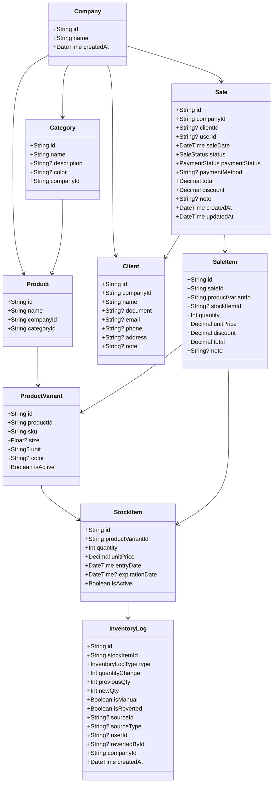

## 🧱 Modeled Entities

### `Company`
| Field      | Type      | Description                     |
|------------|-----------|---------------------------------|
| id         | String    | Unique identifier               |
| name       | String    | Company name                    |
| createdAt  | DateTime  | Creation date                   |

---

### `Category`
| Field       | Type      | Description                     |
|-------------|-----------|---------------------------------|
| id          | String    | Category ID                     |
| name        | String    | Name                            |
| description | String?   | Optional description            |
| color       | String?   | Visual color (for frontend UI) |
| companyId   | String    | Linked company                  |
| createdAt   | DateTime  | Creation date                   |

---

### `Product`
| Field       | Type      | Description                     |
|-------------|-----------|---------------------------------|
| id          | String    | Product ID                      |
| name        | String    | Product name                    |
| categoryId  | String    | Related category                |
| companyId   | String    | Owning company                  |

---

### `ProductVariant`
| Field       | Type      | Description                     |
|-------------|-----------|---------------------------------|
| id          | String    | Variant ID                      |
| productId   | String    | Parent product                  |
| sku         | String    | Unique SKU                      |
| size        | Float?    | Size value (e.g. 300)           |
| unit        | String?   | Unit of measure (ml, kg, etc.) |
| color       | String?   | Color or other variation        |
| isActive    | Boolean   | Visibility flag                 |

---

### `StockItem`
| Field           | Type      | Description                   |
|------------------|-----------|-------------------------------|
| id               | String    | Stock item ID                 |
| productVariantId | String    | Related variant               |
| quantity         | Int       | Current quantity              |
| unitPrice        | Decimal   | Cost price                    |
| entryDate        | DateTime  | Entry date                    |
| expirationDate   | DateTime? | Expiration (optional)         |
| isActive         | Boolean   | Visibility flag               |

---

### `InventoryLog`
| Field           | Type      | Description                     |
|------------------|-----------|---------------------------------|
| id               | String    | Log ID                          |
| stockItemId      | String    | Affected stock item             |
| type             | Enum      | Movement type                   |
| quantityChange   | Int       | Change (can be negative)        |
| previousQty      | Int       | Quantity before                 |
| newQty           | Int       | Quantity after                  |
| isManual         | Boolean   | Whether it was manual           |
| isReverted       | Boolean   | Whether it was reverted         |
| sourceId         | String?   | Source ID (e.g. sale ID)        |
| userId           | String?   | Executing user                  |
| revertedById     | String?   | Reverting user                  |
| createdAt        | DateTime  | Log timestamp                   |

---

### `Client`
| Field      | Type      | Description                     |
|------------|-----------|---------------------------------|
| id         | String    | Client ID                       |
| companyId  | String    | Linked company                  |
| name       | String    | Client name                     |
| document   | String?   | CPF/CNPJ/ID                     |
| email      | String?   | Email                           |
| phone      | String?   | Phone number                    |
| address    | String?   | Address                         |
| note       | String?   | Notes                           |

---

### `Sale`
| Field          | Type      | Description                     |
|----------------|-----------|---------------------------------|
| id             | String    | Sale ID                         |
| companyId      | String    | Company                         |
| clientId       | String?   | Client (optional)               |
| userId         | String?   | Creator user                    |
| saleDate       | DateTime  | Date of the sale                |
| status         | Enum      | Sale status                     |
| paymentStatus  | Enum      | Payment status                  |
| paymentMethod  | String?   | Payment method                  |
| total          | Decimal   | Final amount                    |
| discount       | Decimal   | Total discount                  |
| note           | String?   | General notes                   |
| createdAt      | DateTime  | Creation timestamp              |
| updatedAt      | DateTime  | Last update                     |

---

### `SaleItem`
| Field            | Type      | Description                     |
|------------------|-----------|---------------------------------|
| id               | String    | Sale item ID                    |
| saleId           | String    | Related sale                    |
| productVariantId | String    | Sold product                    |
| stockItemId      | String?   | Batch used                      |
| quantity         | Int       | Quantity sold                   |
| unitPrice        | Decimal   | Price per unit                  |
| discount         | Decimal   | Applied discount                |
| total            | Decimal   | Total after discount            |
| note             | String?   | Additional note                 |

---

### Diagram

